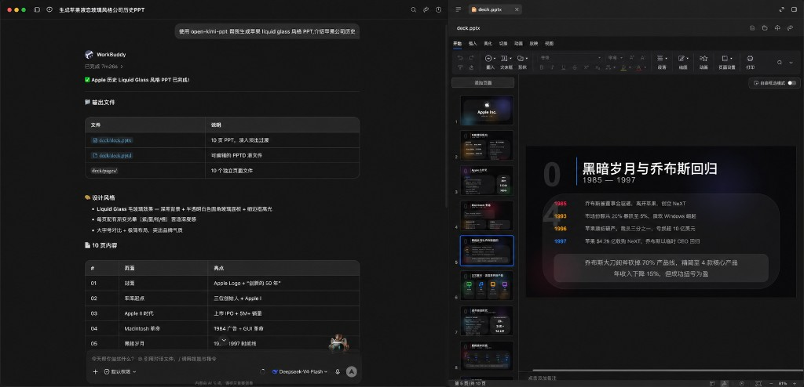
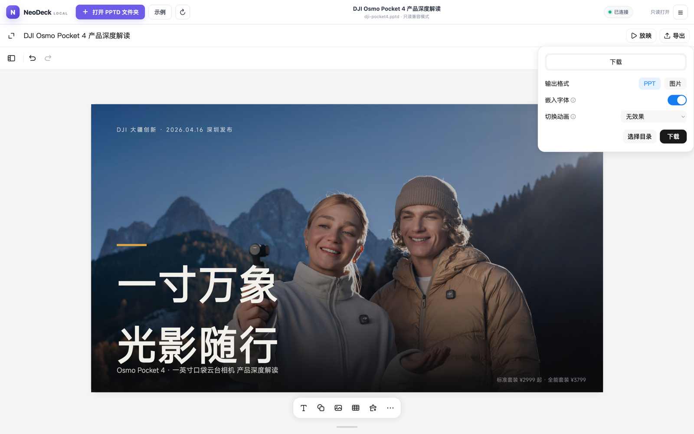

# open-kimi-ppt-skills

[简体中文](README.md) | [English](README_EN.md)

[](https://www.npmjs.com/package/open-kimi-ppt-skills)
[](https://nodejs.org)

An unofficial presentation skill for AI coding agents, reverse-engineered from Kimi Slides. It lets your agent create, edit, replicate, read, and export PPT/PPTX files. **Every run delivers two outputs by default: an editable PPTD project and a ready-to-use PPTX** — fonts embedded and fade transitions included — plus a local in-browser PPTD editor with manual PPTX export. Works with Codex, Claude Code, Cursor, CodeBuddy, and any agent that supports the SKILL.md format.

> [!IMPORTANT]
> This project is implemented by reverse-engineering the Kimi Slides skill, the PPTD format, and the frontend behavior and communication protocol of the publicly accessible web editor. It is not an official Kimi or Moonshot AI project and is not endorsed or supported by them. Public frontend resources and compatibility contracts used by this project may change without notice. Provided for learning and research purposes only.

## Features

- **PPTD generation**: let your agent generate complete, editable PPTD projects — from scratch, with style transfer, template reuse, or replication from images/PDFs.
- **PPTX generation**: produce a matching PPTX by default, with fonts embedded and fade transitions written automatically.
- **Visual QA**: with a multimodal model, the skill exports every page as an image, stitches them into an overview sheet, and checks each page (distortion, occlusion, out-of-bounds elements, contrast, layout consistency, text overflow) before PPTX export — fixing and re-checking until every page passes.
- **Online editing**: view and edit local PPTD projects in a browser, with autosave and configurable slide transitions.
- **Manual export**: export PPTX manually from the editor at any time.
- **Format conversion**: convert existing PPTX files to PPTD for further editing.
- **Secure by design**: local editing only reads and writes project directories explicitly authorized by the user.

## Why open-kimi-ppt

Most PPT skills fall into three buckets: assemble OOXML / pptxgenjs in code, render each slide as a full-bleed image, or ship a swipeable HTML deck. open-kimi-ppt takes a **PPTD intermediate layer + real editable PPTX** path — easy for agents to write, good to look at, and still editable in PowerPoint.

| | open-kimi-ppt | Code-built PPTX (e.g. pptxgenjs) | Full-slide image PPT | Web HTML PPT |
| --- | --- | --- | --- | --- |
| Deliverable | PPTD project + PPTX | Usually PPTX only | Usually PPTX only | Single HTML file |
| Agent-friendly | Clear per-page YAML | Lots of coordinates/API detail | Depends on image models & prompts | Strong HTML/CSS template constraints |
| Editable in PowerPoint | Text, shapes, images stay editable | Editable, but hard to refine later | Flat bitmaps — hard to reword | Not native PPTX |
| Visual quality | Real layouts + multimodal QA before export | Relies on agent layout tuning | Cohesive, poster-like | Strong motion; great for live demos |
| Re-editing | Browser visual editor + autosave | Mostly re-run code | Usually regenerate images | Edit HTML source |
| Best for | Formal PPTX you still need to tweak | Structured reports / template fills | Visually unified poster decks | In-browser talks / launches |

In short:

1. **DSL built for agents** — PPTD describes theme, layout, and elements in YAML, more stable than raw OOXML / pptxgenjs, and more locally editable than full-slide images.
2. **Two deliverables by default** — an iterable PPTD project plus a ready-to-open PPTX (embedded fonts, fade transitions).
3. **Truly editable PPTX** — text boxes and shapes remain editable in PowerPoint / WPS, unlike image-only decks.
4. **Local visual editor** — preview, tweak, set transitions, and re-export in the browser without rerunning the whole agent flow.
5. **Visual QA before export** — full-page screenshots plus an overview sheet catch occlusion, overflow, contrast, and layout issues before PPTX is written.
6. **Not locked to the official model — lower cost** — unlike official Kimi Slides, you can run this in any compatible agent with cheaper models such as DeepSeek. Even without multimodal vision, a model that follows the PPTD spec can still produce strong decks (multimodal helps more with the visual QA pass).

[](docs/images/example-deepseek-liquid-glass.png)

*Above: an Apple Liquid Glass-style deck generated with DeepSeek-V4-Flash in CodeBuddy / WorkBuddy.*

### Style and themes

This skill **does not ship a fixed theme or template**. You choose the look.

> [!TIP]
> **Best results come from stating a PPT style in the prompt, or attaching a reference PPT / PPTX template.** With a style constraint or template to follow, output quality is clearly better and more stable. Topic-only prompts leave the agent free to invent a look, so results vary more.

Common approaches:

1. **Describe the style in the prompt** — e.g. dark tech, magazine layout, Apple liquid glass, minimal big-type poster slides;
2. **Provide a reference template** — upload an existing PPT / PPTX / screenshot and ask the agent to transfer colors, layout, and overall style.

You can combine both: lock the look with a template, then add one line about the style you want to emphasize.

## Screenshots

| Edit PPTD online | Export PPTX |
| :---: | :---: |
| [](docs/images/editor-overview.png) | [](docs/images/export-pptx.png) |

## What is PPTD

PPTD is a YAML-based presentation DSL — a simplified abstraction layer over OOXML. It preserves the essentials (theme, page layout, element positions) while dropping complex nesting such as Masters; every page is self-contained — what you see is what you get. See [reference/pptd.md](skills/open-kimi-ppt/reference/pptd.md) for the complete definition.

A complete PPTD project looks like this:

```text
deck/
  deck.pptd     # manifest
  pages/        # one .page file per slide
  media/        # local media assets (if any)
  deck.pptx     # PPTX generated by default
```

## Install

Node.js 18 or later is required. You can also ask your agent: `Install the open-kimi-ppt skills from GitHub for me.`, or: `Install https://github.com/Binaryify/open-kimi-ppt-skill for me.`

Install directly with npx:

```bash
npx open-kimi-ppt-skills install
```

Alternatively, install the CLI globally:

```bash
npm install --global open-kimi-ppt-skills
open-kimi-ppt-skills install
```

By default the installer targets the shared, agent-agnostic directory `~/.agents/skills/open-kimi-ppt`, which compatible agents discover directly. If your agent uses its own skills directory, point `--target` at it:

```bash
# Codex
open-kimi-ppt-skills install --target ~/.codex/skills

# Claude Code
open-kimi-ppt-skills install --target ~/.claude/skills

# Cursor
open-kimi-ppt-skills install --target ~/.cursor/skills

# CodeBuddy
open-kimi-ppt-skills install --target ~/.codebuddy/skills
```

### Update

When the skill is updated, overwrite your local install with `--force`:

```bash
npx open-kimi-ppt-skills@latest install --force
```

If you originally installed with `--target`, pass the same path again:

```bash
npx open-kimi-ppt-skills@latest install --force --target ~/.claude/skills
```

You can also ask your agent: `Update the open-kimi-ppt skill for me.` Updating only replaces the skill files; it does not touch PPTD / PPTX projects you already generated.

## Usage

### Generate a presentation with your agent

Once installed, just describe what you need. **You always get two deliverables by default**: the complete, editable PPTD project directory and the matching PPTX file. PPTX generation is skipped only when you explicitly ask for PPTD-only output.

For more stable quality, put a style in the prompt (e.g. “dark product-launch look”) or attach a reference PPT template; topic-only prompts without style guidance tend to vary more.

```text
Use open-kimi-ppt to create a liquid-glass-style deck about the history of Apple.
```

### Edit online and export manually

Start the local editor:

```bash
npx open-kimi-ppt-skills serve
```

Then open <http://127.0.0.1:55173/> and choose a complete project folder containing the `.pptd` manifest, `pages/`, and `media/` to view, edit, and export PPTX in the browser. The bundled [example/dji-pocket4](example/dji-pocket4) project — a complete 18-page deck — is ready to open for a quick tour.

```bash
# Open the browser after startup
npx open-kimi-ppt-skills serve --open

# Use another port
npx open-kimi-ppt-skills serve --port 56000
```

Writable folder access requires a Chromium-based browser with the File System Access API. Other browsers fall back to read-only folder upload. Press `Ctrl+C` to stop the server.

## How it works and security boundaries

- The CLI serves static files on `127.0.0.1` only and does not listen on LAN interfaces.
- The browser reads a complete PPTD project directory only after explicit user authorization.
- Save callbacks may only modify `.pptd` and `.page` files; absolute paths and `..` traversal are rejected.
- The local host passes PPTD content to the public Kimi web editor. Remote images, fonts, and editor resources may still be fetched from their respective servers.
- This project does not provide or inject Kimi login tokens and does not access private Kimi documents.

## Compatibility

This is a compatibility host for the current public implementation, not a stable official SDK. Updates to Kimi frontend asset hashes, the PPTD format, or the iframe/RPC protocol may require a corresponding project update. Successfully generating a PPTX does not guarantee identical animation playback in PowerPoint, WPS, and Keynote.

## Local development

```bash
npm install --global .
npm test
npm run pack:check
```

## Legal

Kimi, Kimi Slides, and related trademarks belong to their respective owners.
